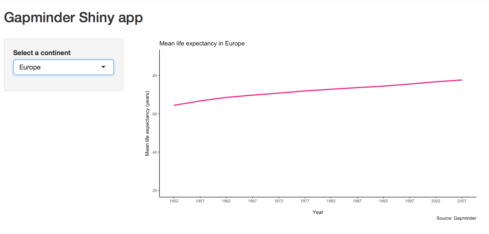

```{r setup, include=FALSE}
options(htmltools.dir.version = FALSE)
```

class: inverse, center, middle


---
# What is Shiny?

--
- An R package developed by [RStudio](https://www.rstudio.com/products/shiny/) that allows data analysts to analyse, visualise and share their results with non-R users

--
- Interactive web applications connected to an R session

--
- No knowledge of HTML, CSS, and JavaScript is required but web apps are customisable and extendible

--
- Integrates with JavaScript libraries

--
- Uses a reactive programming framework. An input is sent to an R process which generates a plot in a web browser.

---
# Advantages of Shiny

--
- The process of loading, cleaning, manipulating and visualising data is possible entirely within R

--
- Lowers barrier of entry to web development

--
- R bindings for JavaScript visualization libraries becoming available all the time

--
- Open source code encourages collaboration

---
# Structure of an app

Each Shiny app has two components: a UI (web page) and a server function (live R session).
 
```{r, eval=FALSE}
library(shiny)
ui <- fluidPage()
server <- function(input, output){}
shinyApp(ui, server)
```

The UI specifies the layout and user interface elements, e.g. HTML widgets like drop-downs, sliders, radio buttons etc., whilst the server specifies how to generate the output, e.g. table, plot, text.

---

class: inverse, center, middle

# Demo

---
# Load the packages
```{r, eval=FALSE}
*library(shiny) 
*library(tidyverse) 
*library(gapminder)
*library(ggplot2)
ui <- fluidPage()
server <- function(input, output){}
shinyApp(ui, server)
```

---
# Test run the template
```{r, eval=FALSE}
library(shiny) 
library(tidyverse) 
library(gapminder)
library(ggplot2)
*ui <- fluidPage()
*server <- function(input, output){}
*shinyApp(ui, server)
```

You can run this template to boot up the draft webpage after you have made editions.

---
# Read (and manipulate) the data
```{r, eval=FALSE}
*df <- gapminder %>% 
*  group_by(continent, year) %>% 
*  summarise(mean_lifeExp = mean(lifeExp))
ui <- fluidPage()
server <- function(input, output){}
shinyApp(ui, server)
```

But we still haven't actually added anything to the webpage yet.

---
# Add a title
```{r, eval=FALSE}
library(shiny) ; library(tidyverse) ; library(gapminder) ; library(ggplot2)
df <- gapminder %>% group_by(continent,year) %>% summarise(mean_lifeExp = mean(lifeExp))
ui <- fluidPage(
*  titlePanel("Gapminder Shiny app")
)
server <- function(input, output){}
shinyApp(ui, server)
```

Now we've added a title.

---
# Add a layout
```{r, eval=FALSE}
library(shiny) ; library(tidyverse) ; library(gapminder) ; library(ggplot2)
df <- gapminder %>% group_by(continent,year) %>% summarise(mean_lifeExp = mean(lifeExp))
ui <- fluidPage(
  titlePanel("Gapminder Shiny app"),  
*  br(),
*  sidebarLayout(
*    sidebarPanel(width = 3),
*    mainPanel())
)
server <- function(input, output){}
shinyApp(ui, server)
```

---
# Add a reactive input
```{r, eval=FALSE}
library(shiny) ; library(tidyverse) ; library(gapminder) ; library(ggplot2)
df <- gapminder %>% group_by(continent,year) %>% summarise(mean_lifeExp = mean(lifeExp))
ui <- fluidPage(
  titlePanel("Gapminder Shiny app"),
  br(),
  sidebarLayout(
    sidebarPanel(width = 3,
*                 selectInput(inputId = "continent", 
*                             label = "Select a continent",
*                             choices = levels(df$continent), 
*                             selected = "Europe")
                 ),
                  mainPanel()))
server <- function(input, output){}
shinyApp(ui, server)
```

---
# Add a reactive
```{r, eval=FALSE}
library(shiny) ; library(tidyverse) ; library(gapminder) ; library(ggplot2)
df <- gapminder %>% group_by(continent,year) %>% summarise(mean_lifeExp = mean(lifeExp))
ui <- fluidPage(
  titlePanel("Gapminder Shiny app"),
  br(),
  sidebarLayout(
    sidebarPanel(width = 3,
                 selectInput(inputId = "continent", label = "Select a continent",
                             choices = levels(df$continent), selected = "Europe")),
                  mainPanel()))
server <- function(input, output){
*  data_points <- reactive({filter(df, continent == input$continent)})
}
shinyApp(ui, server)
```

---
# Add a reactive output
```{r, eval=FALSE}
library(shiny) ; library(tidyverse) ; library(gapminder) ; library(ggplot2)
df <- gapminder %>% group_by(continent,year) %>% summarise(mean_lifeExp = mean(lifeExp))
ui <- fluidPage(
  titlePanel("Gapminder Shiny app"),
  br(),
  sidebarLayout(
    sidebarPanel(width = 3,
                 selectInput(inputId = "continent", label = "Select a continent",
                             choices = levels(df$continent), selected = "Europe")),
                  mainPanel(
*                    plotOutput('plot')
)))
server <- function(input, output){
  data_points <- reactive({filter(df, continent == input$continent)})
}
shinyApp(ui, server)
```

---
# Save output
```{r, eval=FALSE}
library(shiny) ; library(tidyverse) ; library(gapminder) ; library(ggplot2)
df <- gapminder %>% group_by(continent,year) %>% summarise(mean_lifeExp = mean(lifeExp))
ui <- fluidPage(
  titlePanel("Gapminder Shiny app"),
  br(),
  sidebarLayout(
    sidebarPanel(width = 3,
                 selectInput(inputId = "continent", label = "Select a continent",
                             choices = levels(df$continent), selected = "Europe")),
                  mainPanel(plotOutput('plot'))))
server <- function(input, output){
  data_points <- reactive({filter(df, continent == input$continent)})
*  output$plot <-
}
shinyApp(ui, server)
```

---
# Build reactive output
```{r, eval=FALSE}
library(shiny) ; library(tidyverse) ; library(gapminder) ; library(ggplot2)
df <- gapminder %>% group_by(continent,year) %>% summarise(mean_lifeExp = mean(lifeExp))
ui <- fluidPage(
  titlePanel("Gapminder Shiny app"),
  br(),
  sidebarLayout(
    sidebarPanel(width = 3,
                 selectInput(inputId = "continent", label = "Select a continent",
                             choices = levels(df$continent), selected = "Europe")),
                  mainPanel(plotOutput('plot'))))
server <- function(input, output){
  data_points <- reactive({filter(df, continent == input$continent)})
  output$plot <- 
*  renderPlot({ 
*    )}
}
shinyApp(ui, server)
```

---
# Access input values
```{r, eval=FALSE}
library(shiny) ; library(tidyverse) ; library(gapminder) ; library(ggplot2)
df <- gapminder %>% group_by(continent,year) %>% summarise(mean_lifeExp = mean(lifeExp))
ui <- fluidPage(
  titlePanel("Gapminder Shiny app"),
  br(),
  sidebarLayout(
    sidebarPanel(width = 3,
                 selectInput(inputId = "continent", label = "Select a continent",
                             choices = levels(df$continent), selected = "Europe")),
                  mainPanel(plotOutput('plot'))))
server <- function(input, output){
  data_points <- reactive({filter(df, continent == input$continent)})
  output$plot <- renderPlot({
*    ggplot(data_points(), aes(x = year, y = mean_lifeExp)) +
*      geom_line(color = "deeppink2", lwd = 1.2) +
*      scale_x_continuous(breaks = seq(1952, 2007, 5)) +
*      scale_y_continuous(breaks = seq(0, 80, 20), limits = c(20, 90)) +
*      labs(title = paste("Mean life expectancy in", input$continent),
*           x = "\nYear", y = "\nMean life expectancy (years)", caption = "Source: Gapminder") +
*      theme_classic() + 
*      theme(legend.position = "none")})}
shinyApp(ui, server)
```

---
# Run and deploy the app

