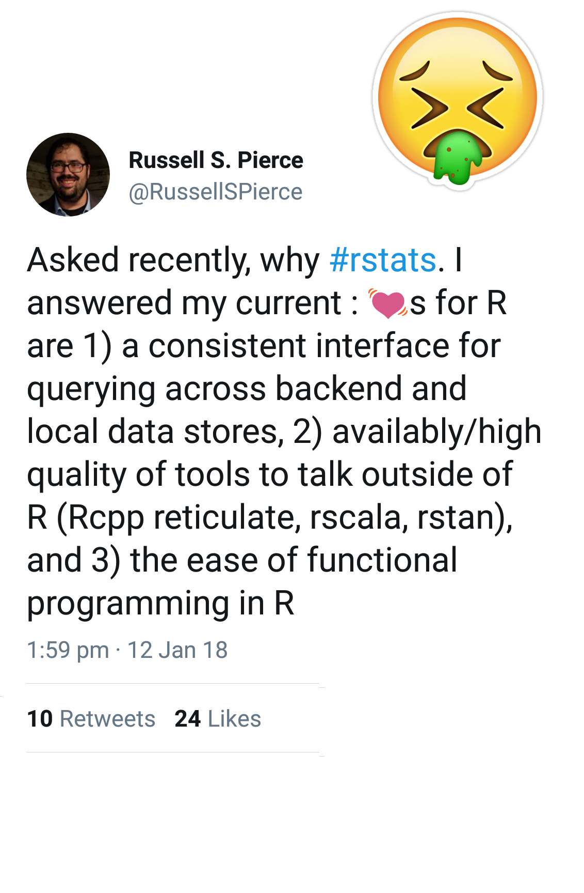
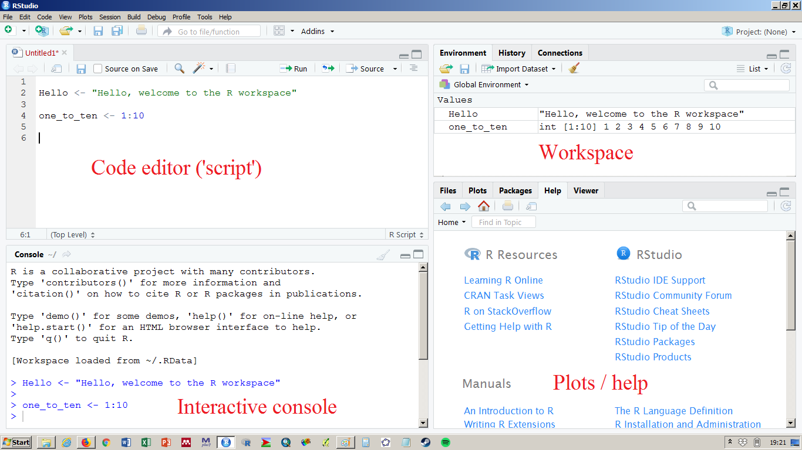

---
title: | 
    | Getting Started in R
    | an introduction to data analysis and visualisation
subtitle: "Basics"
author: "Réka Solymosi & Sam Langton"
date: "2 July 2019"
output:
  xaringan::moon_reader:
    css: ["default", "my-theme.css"]
    lib_dir: libs
    nature:
      highlightStyle: github
      highlightLines: true
      countIncrementalSlides: false
editor_options: 
  chunk_output_type: console
---

```{r setup, include=FALSE}
options(htmltools.dir.version = FALSE)
```

class: inverse, center, middle

# R

---

### What is R?

--

- [R](https://www.r-project.org/) is a programming language for exploring, visualising and analysing data.   

--

- Created by Ross Ihaka and Robert Gentleman (University of Auckland)

--

- Released in 1995

--

- Implements the S programming language created at Bell Labs

--

- Companies like Google, Facebook and the Financial Times use it

---

### Why use R?

--

- *Cutting edge analytics*: over 10,000 user-contributed packages available on finance, genomics, animal tracking, crime analysis, and much more

--

- *Powerful graphics and data visualisations*: used by the New York Times and FiveThirtyEight 

--

- *Open source*: free and customisable

--

- *Reproducibility*: code can be shared and the results repeated   

--

- *Transparency*: explicitly documents all the steps of your analyses   

--

- *Automation*: analyses can be run and re-run with new and existing datasets  

--

- *Support network*: worldwide community of developers and users

---

### Why wouldn't you use it?

- Anxiety about 'hard' skills
- "I am just not good at that  
  kind of thing"
- "I have to be good at maths"  
- Experts putting you off

<div style= "float:right;position: relative; top: -150px;">

```{r, out.width = "400px", echo = F}

```

</div>


---

### Are there any disadvantages?

--

Learning R can be a steep learning curve and the transition from a graphical user interface like Excel or SPSS to one that is command driven can be unsettling.

<div align="center">

</div>

--
<br>
However, you’ll soon find that working with a command line is much more efficient than pointing and clicking. After all, you can replicate, automate and share your R scripts.

---
class: inverse, center, middle

# Example outputs using R

---

### Charts
```{r out.width='700px', fig.height=3, fig.align='center'}
library(ggplot2) 
p <- ggplot(mpg, aes(x = displ, y = hwy)) +  geom_point() +
  geom_smooth(method = "loess", se = FALSE) +
  labs(x = "Engine size", y = "Miles per gallon", 
       title = "Fuel efficiency decreases with engine size") +
  theme_minimal()
p
```

---

### Tables
```{r eval=require('DT'), tidy=FALSE}
library(DT)
DT::datatable(
  head(USArrests, 10),
  fillContainer = FALSE, options = list(pageLength = 5)
)
```

---

### Maps

```{r out.width='100%', fig.height=5, eval=require('leaflet')}
library(leaflet)
leaflet() %>% addTiles() %>% 
  addMarkers(-2.236518, 53.466478, 
             popup = "University of Manchester")
```

---
class: inverse, center, middle
# R and RStudio

---
### R and RStudio
It is possible to just use [R](http://www.r-project.org) but there are several reasons why you will prefer to code within the [RStudio](https://www.rstudio.com/products/rstudio/download3/) environment:

- syntax highlighting
- code completion
- [rmarkdown](http://rmarkdown.rstudio.com) integration
- four-pane workspace for managing R windows

---

### RStudio's panes

```{r, echo = FALSE, out.width = "1200px"}

```

---
class: inverse, center, middle
# Setting up

---
### The working directory
The working directory is where everything created in your R session is stored. The function `getwd()` returns the filepath to the current working directory.

```{r, eval=FALSE}
getwd()
```

To change the working directory you have two options:

1. Use the dropdown menus: *Session -> Set Working Directory -> Choose Directory*
2. Use the command `setwd()` in the console

For example, to change the working directory on a computer running macOS you might enter:

```{r, eval=FALSE}
setwd("/Users/your_name/Documents/GSinR")
```

On a computer running Windows it would look more like:

```{r, eval=FALSE}
setwd("C:/Users/your_name/Documents/GSinR")
```

---
### Installing and loading packages

Packages are collections of R functions and data. There are [over 10,000 user-contributed packages](https://cran.r-project.org/web/packages/available_packages_by_name.html) available to install from CRAN. 

Just type `install.packages()` in the console with the name of the package in inverted commas:

```{r, eval=FALSE}
install.packages("tidyverse")
```

Once installed you can load the package using the `library()` function like this:

```{r, eval=FALSE}
library(tidyverse)
```

---
### Finding help
You can find help within R using the `?` function. For example, if you want to learn more about a function just place a ? before the function name. 

For example, if you wanted to read up on the `getwd()` function you'd enter:

```{r, eval=FALSE}
?getwd
```

You can also use the `help()` function:

```{r, eval=FALSE}
help(getwd)
```

---
class: inverse, center, middle
# R basics

---
### Arithmetic
R provides arithmetic operators operators such as

```{r}
2 + 2 # addition
9 - 7 # subtraction
8 * 12 # multiplication
9 / 3 # division
10 ^ 2 # exponentiation
```

---
### Objects and functions

*Objects* are information (e.g. values, model coefficients, plots etc) stored in R.

```{r}
x <- c(11, 19, 13, 16, 12, 12, 18, 14, 20, NA)
x
```

*Functions* are collections of R commands that do a specific task. Many functions have arguments which provide extra information to the function.

```{r}
mean(x, na.rm = TRUE)
```

---
### Creating variables
The assignment operator (`<-`) is used to assign the value of an expression to a variable. The *object* is being 'given' the whatever the *value* is.

For example, the object 'population' is created by using the `c()` or concatenate function to combine values. 
```{r}
pop <- c(9896000, 2488200, 2434100, 980800, 845000)
pop
```

---
### Data Types
The object 'pop' is a vector, a one-dimensional array with each element separated by a comma. Each element in the vector is a numeric value.
```{r}
class(pop)
```

R support other data types: integer, character, logical, factor, and complex.

Each element in the vector 'city' is a string of one or more characters,
```{r}
# character
city <- c("London", "Birmingham", "Manchester", "Glasgow", "Newcastle")
city
```

whereas the values in 'million_plus' are logical.
```{r}
# logical
million_plus <- c(TRUE, TRUE, TRUE, FALSE, FALSE)
million_plus
```

---
### Creating data frames
Like vectors, data frames are another data structure used in R. Similar to spreadsheets a data frame stores variables in columns and observations in rows. Unlinke matrices, data frames can store variables of different types (e.g. numeric, character).

```{r}
city_pop <- data.frame(city, population = pop, million_plus)
city_pop
```

<br>
<br>
Data source: <http://www.centreforcities.org/data-tool/>

