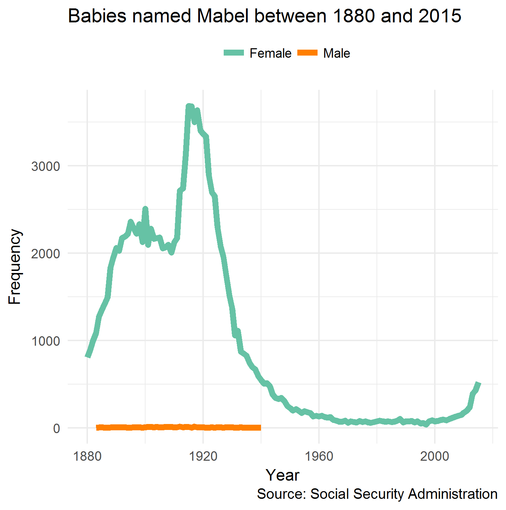

```{r setup, include=FALSE}
options(htmltools.dir.version = FALSE)
```

### `babynames`
Names of boys and girls born each year in the U.S. since 1880
```{r, warning=F}
library(babynames)
babynames
```

---
class: center, middle


---

## The R code
```{r, eval=FALSE}
library(tidyverse) ; library(babynames)

babynames %>%
  filter(name == "Mabel") %>%
  ggplot(data = ., aes(x = year, y = n)) +
  geom_line(aes(color = sex), size = 2) +
  scale_color_manual(values = c("#66c2a5", "#ff7f00"),
                     labels = c("Female", "Male")) +
  labs(title = "Babies named Mabel between 1880 and 2015",
       x = "Year", 
       y = "Frequency",
       caption = "Source: Social Security Administration",
       color = "") +
  theme_minimal()  +
  theme(legend.position = "top")
ggsave("baby_plot.png", scale=1, dpi=300)
```

---
class: center, middle, inverse
# Break it down
---

### Load the R packages
<br>
.pull-left[
```r
*library(tidyverse) ; library(babynames) 

babynames %>%
  filter(name == "Mabel") %>%
  ggplot(data = ., aes(x = year, y = n)) +
  geom_line(aes(color = sex), size = 2) +
  scale_color_manual(values = c("#66c2a5", "#ff7f00"),
                     labels = c("Female", "Male")) +
  labs(title = "Babies named Mabel between 1880 and 2015",
       x = "Year", 
       y = "Frequency",
       caption = "Source: Social Security Administration",
       color = "") +
  theme_minimal()  +
  theme(legend.position = "top")
ggsave("baby_plot.png", scale=1, dpi=300)
```
]

```{r, echo=FALSE, warning = F}

library(tidyverse) ; library(babynames)

```


---
### Access the `babynames` data
<br>
.pull-left[
```r
library(tidyverse) ; library(babynames)

*babynames %>%
  filter(name == "Mabel") %>%
  ggplot(data = ., aes(x = year, y = n)) +
  geom_line(aes(color = sex), size = 2) +
  scale_color_manual(values = c("#66c2a5", "#ff7f00"),
                     labels = c("Female", "Male")) +
  labs(title = "Babies named Mabel between 1880 and 2015",
       x = "Year", 
       y = "Frequency",
       caption = "Source: Social Security Administration",
       color = "") +
  theme_minimal()  +
  theme(legend.position = "top")
ggsave("baby_plot.png", scale=1, dpi=300)
```
]

.pull-right[
```{r, echo=FALSE}
# library(tidyverse) ; library(babynames) 

babynames
```
]
---
### Subset the data
<br>
.pull-left[
```r
library(tidyverse) ; library(babynames)

babynames %>%
* filter(name == "Mabel") %>%
  ggplot(data = ., aes(x = year, y = n)) +
  geom_line(aes(color = sex), size = 2) +
  scale_color_manual(values = c("#66c2a5", "#ff7f00"),
                     labels = c("Female", "Male")) +
  labs(title = "Babies named Mabel between 1880 and 2015",
       x = "Year", 
       y = "Frequency",
       caption = "Source: Social Security Administration",
       color = "") +
  theme_minimal()  +
  theme(legend.position = "top")
ggsave("baby_plot.png", scale=1, dpi=300)
```
]

.pull-right[
```{r, echo=FALSE}
# library(tidyverse) ; library(babynames) 

babynames %>%
  filter(name == "Mabel")
```
]

---
### Initialise a `ggplot()` object, inherit the filtered data, and map variables to the x and y axes
.pull-left[
```r
library(tidyverse) ; library(babynames

babynames %>%
  filter(name == "Mabel") %>%
* ggplot(data = ., aes(x = year, y = n)) +
  geom_line(aes(color = sex), size = 2) +
  scale_color_manual(values = c("#66c2a5", "#ff7f00"),
                     labels = c("Female", "Male")) +
  labs(title = "Babies named Mabel between 1880 and 2015",
       x = "Year", 
       y = "Frequency",
       caption = "Source: Social Security Administration",
       color = "") +
  theme_minimal()  +
  theme(legend.position = "top")
ggsave("baby_plot.png", scale=1, dpi=300)
```
]

.pull-right[
```{r, echo=FALSE}
# library(tidyverse) ; library(babynames)

babynames %>%
  filter(name == "Mabel") %>%
  ggplot(data = ., aes(x = year, y = n))
```
]

---
### Use `geom_line()` to connect observations, map the `sex` variable to colour and set line thickness
.pull-left[
```r
library(tidyverse) ; library(babynames) 

babynames %>%
  filter(name == "Mabel") %>%
  ggplot(data = ., aes(x = year, y = n)) +
* geom_line(aes(color = sex), size = 2) +
  scale_color_manual(values = c("#66c2a5", "#ff7f00"),
                     labels = c("Female", "Male")) +
  labs(title = "Babies named Mabel between 1880 and 2015",
       x = "Year", 
       y = "Frequency",
       caption = "Source: Social Security Administration",
       color = "") +
  theme_minimal()  +
  theme(legend.position = "top")
ggsave("baby_plot.png", scale=1, dpi=300)
```
]

.pull-right[
```{r, echo=FALSE}
# library(tidyverse) ; library(babynames) 

babynames %>%
  filter(name == "Mabel") %>%
  ggplot(data = ., aes(x = year, y = n)) +
  geom_line(aes(color = sex), size = 2)
```
]

---
### Specify which colours the `sex` variable is mapped to
<!-- <br> -->
.pull-left[
```r
library(tidyverse) ; library(babynames) 

babynames %>%
  filter(name == "Mabel") %>%
  ggplot(data = ., aes(x = year, y = n)) +
  geom_line(aes(color = sex), size = 2) +
* scale_color_manual(values = c("#66c2a5", "#ff7f00"),
*                    labels = c("Female", "Male")) +
  labs(title = "Babies named Mabel between 1880 and 2015",
       x = "Year", 
       y = "Frequency",
       caption = "Source: Social Security Administration",
       color = "") +
  theme_minimal()  +
  theme(legend.position = "top")
ggsave("baby_plot.png", scale=1, dpi=300)
```
]

.pull-right[
```{r, echo=FALSE}
# library(tidyverse) ; library(babynames) 

babynames %>%
  filter(name == "Mabel") %>%
  ggplot(data = ., aes(x = year, y = n)) +
  geom_line(aes(color = sex), size = 2) +
  scale_color_manual(values = c("#66c2a5", "#ff7f00"),
                     labels = c("Female", "Male"))
```
]

---
### Add a title, label the axes, include a caption, and drop the legend title
<!-- <br> -->
.pull-left[
```r
library(tidyverse) ; library(babynames) 

babynames %>%
  filter(name == "Mabel") %>%
  ggplot(data = ., aes(x = year, y = n)) +
  geom_line(aes(color = sex), size = 2) +
  scale_color_manual(values = c("#66c2a5", "#ff7f00"),
                     labels = c("Female", "Male")) +
* labs(title = "Babies named Mabel between 1880 and 2015",
*      x = "Year", 
*      y = "Frequency",
*      caption = "Source: Social Security Administration",
*      color = "") +
  theme_minimal()  +
  theme(legend.position = "top")
ggsave("baby_plot.png", scale=1, dpi=300)
```
]

.pull-right[
```{r, echo=FALSE}
# library(tidyverse) ; library(babynames)

babynames %>%
  filter(name == "Mabel") %>%
  ggplot(data = ., aes(x = year, y = n)) +
  geom_line(aes(color = sex), size = 2) +
  scale_color_manual(values = c("#66c2a5", "#ff7f00"),
                     labels = c("Female", "Male")) +
  labs(title = "Babies named Mabel between 1880 and 2015",
       x = "Year", 
       y = "Frequency",
       caption = "Source: Social Security Administration",
       color = "")
```
]

---
### Use a `ggplot2` theme to format the chart
<br>
.pull-left[
```r
library(tidyverse) ; library(babynames) 

babynames %>%
  filter(name == "Mabel") %>%
  ggplot(data = ., aes(x = year, y = n)) +
  geom_line(aes(color = sex), size = 2) +
  scale_color_manual(values = c("#66c2a5", "#ff7f00"),
                     labels = c("Female", "Male")) +
  labs(title = "Babies named Mabel between 1880 and 2015",
       x = "Year", 
       y = "Frequency",
       caption = "Source: Social Security Administration",
       color = "") +
* theme_minimal()  +
  theme(legend.position = "top")
ggsave("baby_plot.png", scale=1, dpi=300)
```
]

.pull-right[
```{r, echo=FALSE}
# library(tidyverse) ; library(babynames) 

babynames %>%
  filter(name == "Mabel") %>%
  ggplot(data = ., aes(x = year, y = n)) +
  geom_line(aes(color = sex), size = 2) +
  scale_color_manual(values = c("#66c2a5", "#ff7f00"),
                     labels = c("Female", "Male")) +
  labs(title = "Babies named Mabel between 1880 and 2015",
       x = "Year", 
       y = "Frequency",
       caption = "Source: Social Security Administration",
       color = "") +
  theme_minimal() 
```
]

---
### Move the legend to the top of the plot
<br>
.pull-left[
```r
library(tidyverse) ; library(babynames) 

babynames %>%
  filter(name == "Mabel") %>%
  ggplot(data = ., aes(x = year, y = n)) +
  geom_line(aes(color = sex), size = 2) +
  scale_color_manual(values = c("#66c2a5", "#ff7f00"),
                     labels = c("Female", "Male")) +
  labs(title = "Babies named Mabel between 1880 and 2015",
       x = "Year", 
       y = "Frequency",
       caption = "Source: Social Security Administration",
       color = "") +
  theme_minimal()  +
* theme(legend.position = "top")
ggsave("baby_plot.png", scale=1, dpi=300)
```
]

.pull-right[
```{r, echo=FALSE}
# library(tidyverse) ; library(babynames) 

babynames %>%
  filter(name == "Mabel") %>%
  ggplot(data = ., aes(x = year, y = n)) +
  geom_line(aes(color = sex), size = 2) +
  scale_color_manual(values = c("#66c2a5", "#ff7f00"),
                     labels = c("Female", "Male")) +
  labs(title = "Babies named Mabel between 1880 and 2015",
       x = "Year", 
       y = "Frequency",
       caption = "Source: Social Security Administration",
       color = "") +
  theme_minimal()  +
  theme(legend.position = "top")
```
]

---
### Save the plot as a png at a high resolution
<br>
.pull-left[
```r
library(tidyverse) ; library(babynames) 

babynames %>%
  filter(name == "Mabel") %>%
  ggplot(data = ., aes(x = year, y = n)) +
  geom_line(aes(color = sex), size = 2) +
  scale_color_manual(values = c("#66c2a5", "#ff7f00"),
                     labels = c("Female", "Male")) +
  labs(title = "Babies named Mabel between 1880 and 2015",
       x = "Year", 
       y = "Frequency",
       caption = "Source: Social Security Administration",
       color = "") +
  theme_minimal()  +
  theme(legend.position = "top")
*ggsave("baby_plot.png", scale=1, dpi=300)
```
]

.pull-right[
```{r, echo=FALSE}
# library(tidyverse) ; library(babynames) 

babynames %>%
  filter(name == "Mabel") %>%
  ggplot(data = ., aes(x = year, y = n)) +
  geom_line(aes(color = sex), size = 2) +
  scale_color_manual(values = c("#66c2a5", "#ff7f00"),
                     labels = c("Female", "Male")) +
  labs(title = "Babies named Mabel between 1880 and 2015",
       x = "Year", 
       y = "Frequency",
       caption = "Source: Social Security Administration",
       color = "") +
  theme_minimal()  +
  theme(legend.position = "top")
```
]

---
class: center, middle, inverse
# Your turn