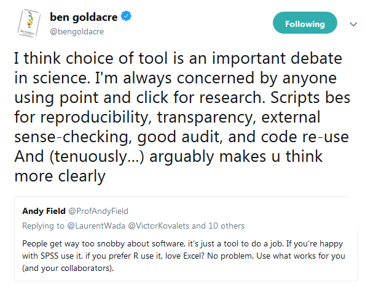

```{r setup, include=FALSE}
options(htmltools.dir.version = FALSE)
```

class: inverse, center, middle
# Welcome!

---
## About us


```{r, out.width = "100px", echo=FALSE}
knitr::include_graphics("https://avatars1.githubusercontent.com/u/7291547?v=3&s=400")
```

@r_solymosi

```{r, out.width = "100px", echo=FALSE}
knitr::include_graphics("https://avatars0.githubusercontent.com/u/36928709?s=400&v=4")
```

@sh_langton


```{r, out.width = "100px", echo=FALSE}
knitr::include_graphics("https://pbs.twimg.com/profile_images/826431771868807168/42VQ-_sY_400x400.jpg")

```

@emily_buehler

---
## About you

---
## About the course

**Schedule**

|         | Slot   | Module                                                | 
|:--------|:-------|:------------------------------------------------------|
| **1**   | Mon pm | Intro                                   | 
| **2.1** | Tue am | Basics                                   | 
| **2.2** | Tue pm | Import data                          | 
| **3.1** | Wed am | Tidy data                           | 
| **3.2** | Wed pm | Transform data                    | 
| **4.1** | Thu am | Visualise data                     |
| **4.2** | Thu pm | Model data                   |
| **5**   | Fri am | Reporting data |

<br>

---
## About the course

By the end of the week you will be able to:

- be able to read and write basic R code
- read your data into R Studio
- tidy (prep) your data for analysis
- filter and subset data
- summarise and create new variables
- visualise your data
- model your data
- presenting results in a report

---
## Why R?

 - growing popularity
 - reproducable
 - learn to code
 - diverse
 - open source
 - community driven

 
---
## Growing popularity

```{r, out.height = "450px", echo=FALSE}
knitr::include_graphics('https://i0.wp.com/r4stats.com/wp-content/uploads/2017/06/Fig_2d_ScholarlyImpact2016.png')
```

source: http://r4stats.com/articles/popularity/


---
## Growing popularity

```{r, out.height = "450px", echo=FALSE}
knitr::include_graphics('https://i0.wp.com/r4stats.com/wp-content/uploads/2017/06/Fig_2e_ScholarlyImpactSubset2016.png?w=650')
```

source: http://r4stats.com/articles/popularity/

---
## Growing popularity

```{r, out.height = "450px", echo=FALSE}
knitr::include_graphics('https://i0.wp.com/r4stats.com/wp-content/uploads/2017/02/Fig-1a-IndeedJobs-2017.png?w=650')
```
  
source: http://r4stats.com/articles/popularity/

---
## Reproducible


```{r, out.width = "600px", echo=FALSE}

```

---
## Reproducible

```{r, out.width = "600px", echo=FALSE}

```

---
## Reproducible: the point

- People are very opinionated about it
- Replication and transparency is a key debate in research
- The need for replication is blind to research discipline
- One day we might not have a choice in the matter
- Either way, it will make your life a lot easier!

---
## Diverse: Inferential stats

```{r, echo=TRUE, warning=FALSE, eval=FALSE}
library(stats)
```

```{r, echo=TRUE, warning=FALSE, eval=FALSE}

mean()
sd()
chisq.test()
t.test()
aov()
glm()

```


---
## Diverse: Plots

```{r, out.width = "450px"}
plot(cars$speed, cars$dist)
```

---
## Diverse: Plots
```{r, message = F, warning = F}
library(ggplot2)
```

```{r, echo=FALSE, warning=FALSE, message=FALSE, out.width="500px"}
library(gapminder)
gap_bit <- subset(gapminder, year == 2007 & continent != "Oceania")
gap_bit <- gap_bit[with(gap_bit, order(continent, -1 * pop)), ]

ggplot(gap_bit, aes(x = gdpPercap, y = lifeExp, size = pop)) +
  scale_x_log10(limits = c(150, 115000)) + ylim(c(16, 96)) +
  geom_point(pch = 21, color = 'grey20', show_guide = FALSE) +
  scale_size_area(max_size = 40) +
  facet_wrap(~ continent) + coord_fixed(ratio = 1/43) +
  aes(fill = country) + scale_fill_manual(values = country_colors) +
  theme_minimal() + theme(strip.text = element_text(size = rel(1.1)))
```


---
## Diverse: Plots

```{r, warning=FALSE, message=FALSE}
library(waffle)
```

```{r, echo=FALSE, out.height = "450px"}
t <- c('Remain' = 35,	
       "Leave" = 37,	
      # "Spoilt vote" = 0,
       "Didn't vote"	 = 28)

waffle(t, rows = 10, colors=c("#a6cee3",
                              "#1f78b4",
                     #         "#b2df8a",
                              "#33a02c"), 
       title="Brexit results", 
       xlab="1 square = 1%")
```


---
## Diverse: Maps

```{r, echo=TRUE, warning=FALSE, eval=FALSE}
library(ggplot2) ; library(sf)
```

```{r, out.width = "450px", echo=FALSE}

```

---
## Diverse: Stylised Maps
```{r, echo=TRUE, warning=FALSE, eval=FALSE}
library(ggplot2) ; library(sf) # + open code
```

```{r, out.width = "450px", echo=FALSE}

```

---
## Diverse: Sequence analysis

```{r, echo=TRUE, warning=FALSE, eval=FALSE}
library(TraMineR)
```

```{r, echo=FALSE}

```

---
## Diverse: Spatial autocorrelation

```{r, echo=TRUE, warning=FALSE, eval=FALSE}
library(spdep)
```


```{r, out.width = "700px", echo=FALSE}

```

---
## Diverse: Aoristic analysis

```{r, echo=TRUE, warning=FALSE, eval=FALSE}
library(aoristic)
```

```{r, out.width = "700px", echo=FALSE}

```


---
## Diverse: Social network analyis

```{r, echo=TRUE, warning=FALSE, eval=FALSE}
library(igraph)
```

```{r, out.height = "450px", echo=FALSE}
knitr::include_graphics('http://www.rdatamining.com/_/rsrc/1336980493578/examples/social-network-analysis/sna-terms-1.png')
                
```

---
## Diverse: Text mining

```{r, echo=TRUE, warning=FALSE, eval=FALSE}
library(tidytext) ; library(geniusR)
```

```{r, echo=FALSE, out.width="480px"}

```

---

## Diverse: Text analysis

```{r, echo=TRUE, warning=FALSE, eval=FALSE}
library(tidytext) ; library(geniusR)
```

```{r, echo=FALSE}
knitr::include_graphics('https://i2.wp.com/www.johnmackintosh.com/img/2018-01-28-album-word-correlations-original.png?w=456&ssl=1')
```

[Source: John MacKintosh on R bloggers](https://www.r-bloggers.com/hardwired-for-tidy-text/)

---

## Diverse: Text analysis

```{r, echo=TRUE, warning=FALSE, eval=FALSE}
library(tidytext) 
```

```{r, echo=FALSE, out.width="550px"}

```

[Source: Jakub Glinka on R bloggers](https://www.r-bloggers.com/sentiment-analysis-of-the-lord-of-the-rings-with-tidytext/)

---

## Diverse: interactive maps

```{r, echo=TRUE, warning=FALSE, eval=FALSE}
library(tmap)
```

```{r, echo=FALSE}

```

---

## Diverse: Shiny apps to visualise voting

```{r, out.width = "700px", echo=FALSE}
knitr::include_graphics('img/brexit.gif')
```

---

## Open tools

```{r, echo=FALSE, out.width="700px"}

```

---

## Open source

```{r, out.width = "600px", echo=FALSE}
knitr::include_graphics('https://media.giphy.com/media/A06UFEx8jxEwU/giphy.gif')
```


---
## Open source


```{r, out.width = "600px", echo=FALSE}

```

---
## Community driven

```{r, out.width = "600px", echo=FALSE}

```

---
## Community driven

```{r, out.width = "600px", echo=FALSE}

```

---
## Community driven

```{r, echo=FALSE}
knitr::include_graphics('img/manchester_r.png')
```

---

## Community driven

```{r, out.width = "150px", echo=FALSE}

knitr::include_graphics('https://avatars1.githubusercontent.com/u/11410476?v=3&s=200')

knitr::include_graphics('https://d21ii91i3y6o6h.cloudfront.net/gallery_images/from_proof/12936/large/1464301097/number-rcatladies.png')
knitr::include_graphics('https://pbs.twimg.com/media/CyW_of8XAAAbKul.jpg')
```

---
## Community driven

```{r, out.width = "600px", echo=FALSE}

```

---
## Community driven

```{r, out.width = "600px", echo=FALSE}

```

---
## Community driven

```{r, out.width = "600px", echo=FALSE}

```


---
## Community driven

Top resources: 
 - Stack Overflow
 - RPubs
 - R4DS
 - Twitter

---
## Community driven

```{r, out.width = "700px", echo=FALSE}
knitr::include_graphics('img/twitter_profiles.png')
```
 
---
## Join the community

```{r, out.width = "600px", echo=FALSE}
knitr::include_graphics('https://media.giphy.com/media/l3UcwPQnD2yQ62vWE/giphy.gif')

```

---
## After coffee

- get to know R Studio 
- learn about packages
- open, edit and run an R script
- save the output


