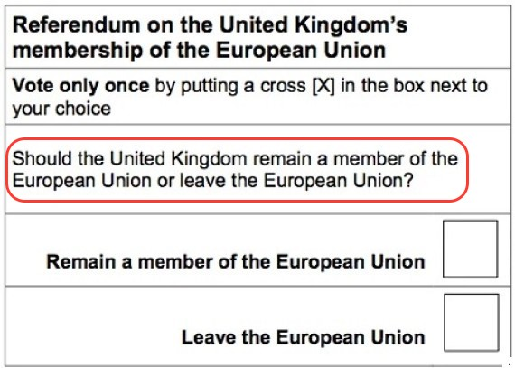
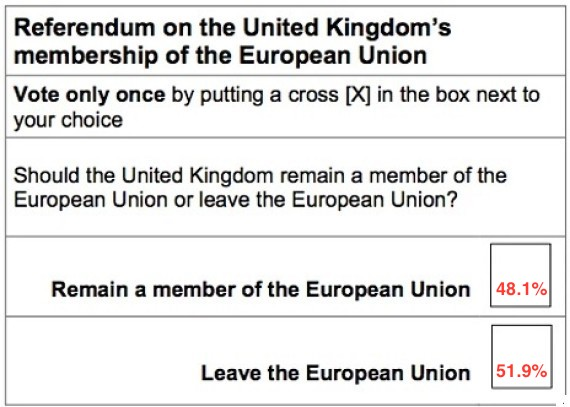
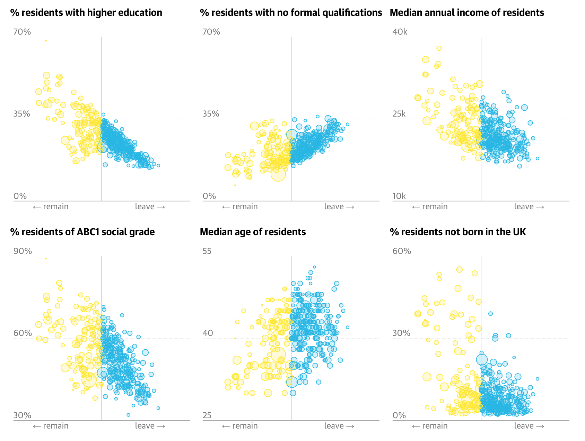
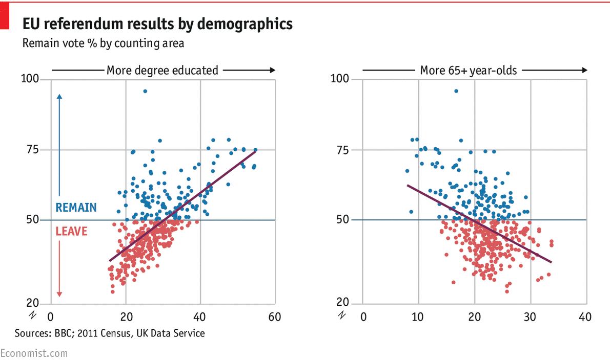
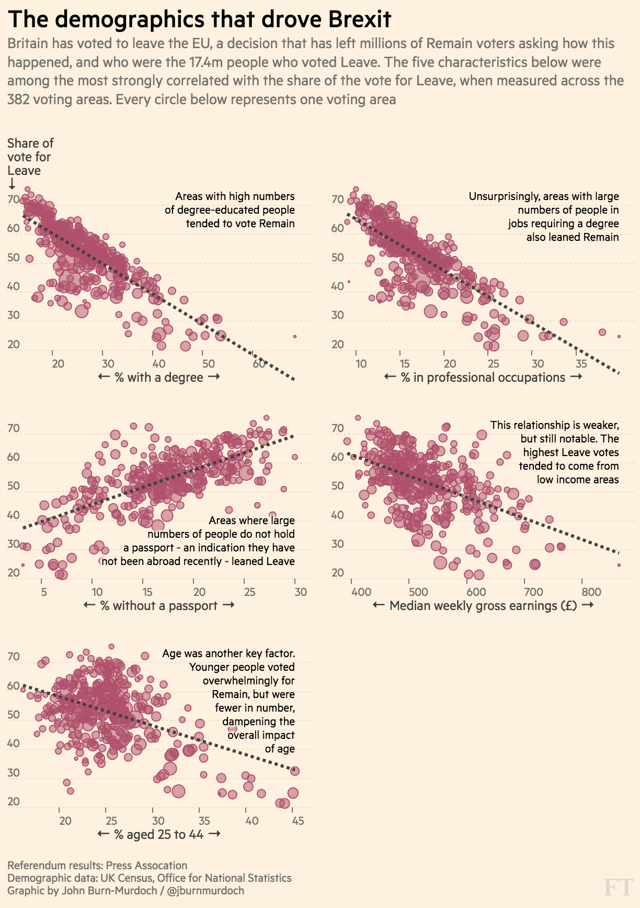
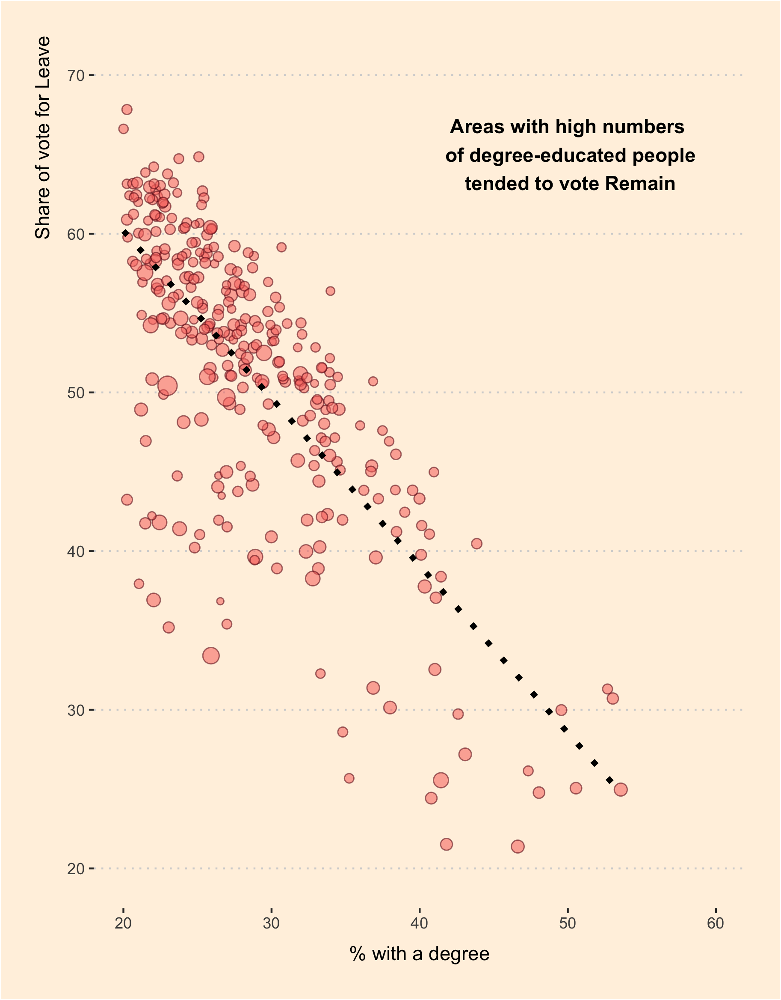

```{r setup, include=FALSE}
options(htmltools.dir.version = FALSE)
```

## Background

On 23 June 2016 the UK electorate was asked:
<br>
<br>

--



---
## Background

On 23 June 2016 the UK electorate was asked:
<br>
<br>



<br>
--

Several newspapers tried to explain this unexpected result ...

---
class: center, middle
### The Guardian


<https://www.theguardian.com/politics/ng-interactive/2016/jun/23/eu-referendum-live-results-and-analysis>

---
class: center, middle
### The Economist


<http://www.economist.com/blogs/graphicdetail/2016/06/daily-chart-17>

---
class: center, middle
### Financial Times


<http://blogs.ft.com/ftdata/2016/06/24/brexit-demographic-divide-eu-referendum-results/>

---
class: center, middle, inverse
## We are going to do the same in R!

---
class: center, middle
## FT-style scatterplot (using ggplot2)


---
## Task

Visualise the relationship between a number of different socio-demographic variables and EU Referendum voting patterns.

You'll need to:

1. **Import**: download and read data
2. **Tidy**: clean data for analysis in R
3. **Transform**: create new variables and merge different data sets
4. **Visualise**: create a set of scatterplots
5. **Report**: put together a summary document of your findings


---
## Option B

Do your own thing (BYOD - bring your own data)

1. **Import**: download and read data
2. **Tidy**: clean data for analysis in R
3. **Transform**: create new variables and merge different data sets
4. **Visualise**: create a set of scatterplots
5. **Report**: put together a summary document of your findings
