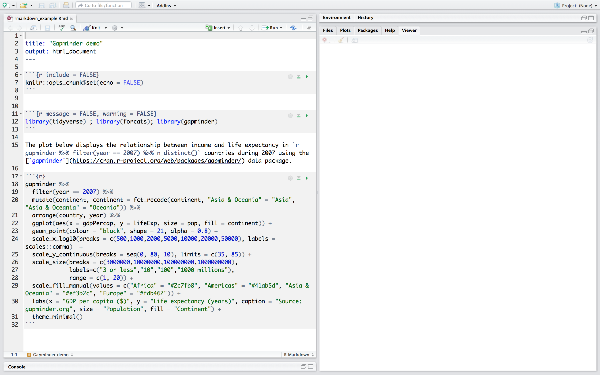
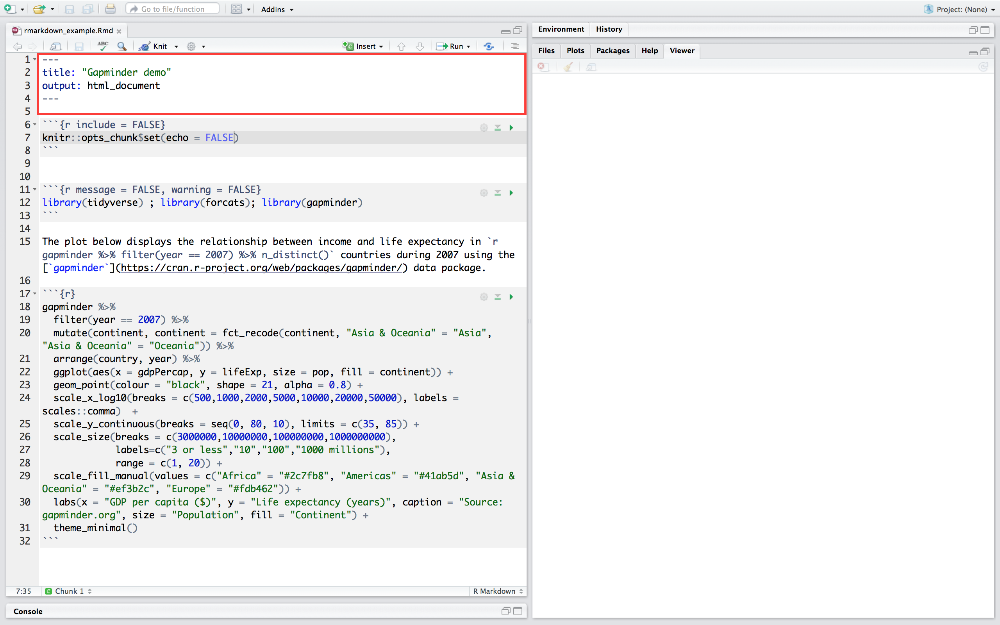
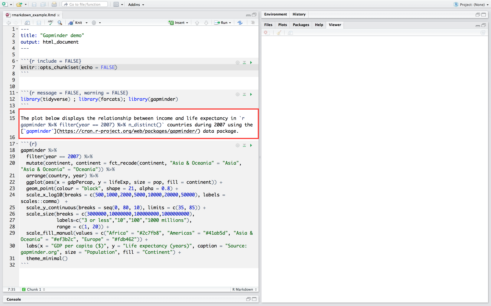
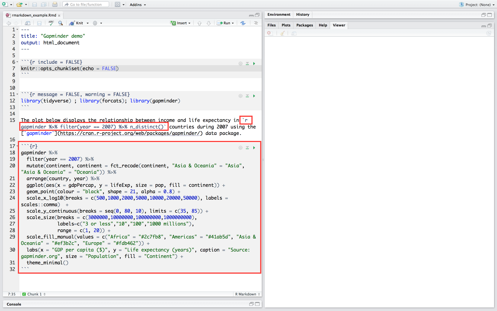
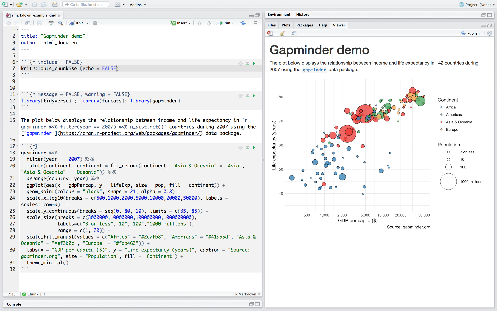

```{r setup, include=FALSE}
options(htmltools.dir.version = FALSE)
```

class: inverse, center, middle

# Markdown

---
### What is Markdown?

Developed by John Gruber in 2004, [Markdown](https://daringfireball.net/projects/markdown/) is a simple formatting syntax for plain text documents that can be easily converted into HTML.      

Markdown allows you to add formatting to plain text without the need to point and click in a word processor. With a few special characters, like asterisks for *emphasis*, you can focus on your writing without leaving the keyboard.

- It’s just plain text
- The formatting syntax is easy to remember
- And there’s no need to use a mouse

---
In Markdown
```{md, verbatim = TRUE}
### What is Markdown?

Developed by John Gruber in 2004, [Markdown](https://daringfireball.net/projects/markdown/) is a simple formatting syntax for plain text documents that can be easily converted into HTML.     

Markdown allows you to add formatting to plain text without the need to point and click in a word processor. With a few special characters, like asterisks for *emphasis*, you can focus on your writing without leaving the keyboard.

- It’s just plain text
- The formatting syntax is easy to remember
- And there’s no need to use a mouse
```

In HTML

```{HTML, verbatim = TRUE}
<html><head>
  <title>Page Title</title>
  </head>
  <body>
  <h3>Writing with HTML</h3><p>Developed by John Gruber in 2004, <a href="https://daringfireball.net/projects/markdown/">Markdown</a> is a simple formatting syntax for plain text documents that can be easily converted into HTML.</p>
  <p>Markdown allows you to add formatting to plain text without the need to point and click in a word processor. With a few special characters, like asterisks for <em>emphasis</em>, you can focus on your writing without leaving the keyboard.</p>
  <ul>
  <li>It’s just plain text</li>
  <li>The formatting syntax is easy to remember</li>
  <li>And there’s no need to use a mouse</li>
  </ul>
  </body></html>
```
---

class: inverse, center, middle

# Markdown syntax

---
## Emphasis

Use a mixture of asterisks and tilde to add emphasis.

`**bold**` → **bold**

`*italics*` → *italics*

`***bold italics***` → ***bold italics***

`~~strikethrough~~` → ~~strikethrough~~

---
## Paragraphs

```{md, verbatim = TRUE}
End a line with two or more spaces to create
a line break
```

End a line with two or more spaces to create  
a line break

---
## Headings

To create a header begin a line with a hash. Each additional hash makes the header smaller.

`# 1st level heading`   
`## 2nd level heading`   
`### 3rd level heading`   
`#### 4th level heading`     

# 1st level heading 
## 2nd level heading  
### 3rd level heading
#### 4th level heading

---
## Links

Place the link text in square brackets and the URL in parentheses

`Download and install the latest version of R [here](https://www.r-project.org)`

Download and install the latest version of R [here](https://www.r-project.org)

---
## Images

Place (optional) explanatory text in brackets and the image URL or path in parentheses, preceded by an exclamation mark

``   


---
## Code
**Inline code**

Wrap code in single backticks
```
Today’s date is `format(Sys.time(), '%d %B, %Y')`
```
Today’s date is `r format(Sys.time(), '%d %B, %Y')`

---
## Code
**Code blocks**

Place 3 backticks on a line above and below the code block

    ```
    library(ggplot2)
    ggplot(mpg, aes(class)) +
    geom_bar(colour = "white")
    ```
```
library(ggplot2)
ggplot(mpg, aes(class)) + 
  geom_bar(colour = "white")
```

---
## Blockquotes

Blockquotes start the first line with a greater than symbol

`> Statistical thinking will one day be as necessary a qualification for efficient citizenship as the ability to read and write.`      
`> (H. G. Wells)`


> Statistical thinking will one day be as necessary a qualification for efficient citizenship as the ability to read and write.    
> (H. G. Wells)

---
## Lists: bullet points

Precede each line in a list with a single asterisk, hyphen or plus sign

```
- ggplot2
- tibble
- tidyr
- readr
- purrr 
- dplyr
```

- ggplot2
- tibble
- tidyr
- readr
- purrr 
- dplyr

---
## Lists: numbered lists

Precede each line in a list with a number and full stop

```
1. ggplot2
2. tibble
3. tidyr
4. readr
5. purrr 
6. dplyr
```

1. ggplot2
2. tibble
3. tidyr
4. readr
5. purrr 
6. dplyr

To prevent text starting with a number being formatted as a numbered list just add a backslash.

`4\. readr`     
4\. readr

---
## Lists: nested lists

Indent each item in the sublist by four spaces

```
1. core tidyverse packages:
    - ggplot2
    - tibble
    - tidyr
    - readr
    - purrr 
    - dplyr
```

1. core tidyverse packages:
    - ggplot2
    - tibble
    - tidyr
    - readr
    - purrr 
    - dplyr

---
class: inverse, center, middle

# GitHub Flavored Markdown

---
## Task lists

Add a space between a dash and an open bracket

```
- [x] Import data
- [x] Tidy data
- [ ] Transform data
- [ ] Visualise data
```

- [x] Import data
- [x] Tidy data
- [ ] Transform data
- [ ] Visualise data

---
## Tables

Divide words with hyphens to create the column names and then separate each row with a pipe. Colons are used to align the values in the cells.

```
| Package | Purpose |
|:----- |:----- |
| ggplot2 | for data visualisation |
| tibble | for tibbles |
| tidyr | for data tidying |
| readr | for importing data |
| purrr | for functional programming |
| dplyr | for data manipulation |
```

| Package | Purpose |
|:----- |:---- |
| ggplot2 | for data visualisation |
| tibble | for tibbles |
| tidyr | for data tidying |
| readr | for importing data |
| purrr | for functional programming |
| dplyr | for data manipulation |

---
## Syntax highlighting

Place three backticks on a line above and below the code block.

    ```{r, eval=FALSE}
    library(ggplot2)
    ggplot(mpg, aes(class)) +
    geom_bar(colour = "white")
    ```

```{r, eval=FALSE}
library(ggplot2)
ggplot(mpg, aes(class)) + 
  geom_bar(colour = "white")
```

---

class: inverse, center, middle


---
# R Markdown: What is it?

--

- Dynamic documents for R

--

- A plain text file (.Rmd) written in markdown containing chunks of embedded R code.

--

- Works with the [`rmarkdown`](https://cran.r-project.org/web/packages/rmarkdown/index.html) R package

---
# R Markdown: Why use it?

--

- Documents with embedded code are reproducible

--

- Integrates the entire data analysis workflow from importing to reporting.

--

- Documents can be outputted to a variety of formats: HTML, PDF, Microsoft Word, slideshows, dashboards, websites, and books.

---
# R Markdown: Example


---
# R Markdown: YAML metadata

---
# R Markdown: Formatted text


---
# R Markdown: Code chunks and inline code


---
# R Markdown: output


---
# R Markdown: workflow
--

- Create a new R Markdown document from the menu: `File -> New File -> R Markdown`

--

- Create a YAML header

--

- Write the content with markdown

--

- Embed the R code in code chunks or inline code

--

- Click the `Knit` button to compile it


