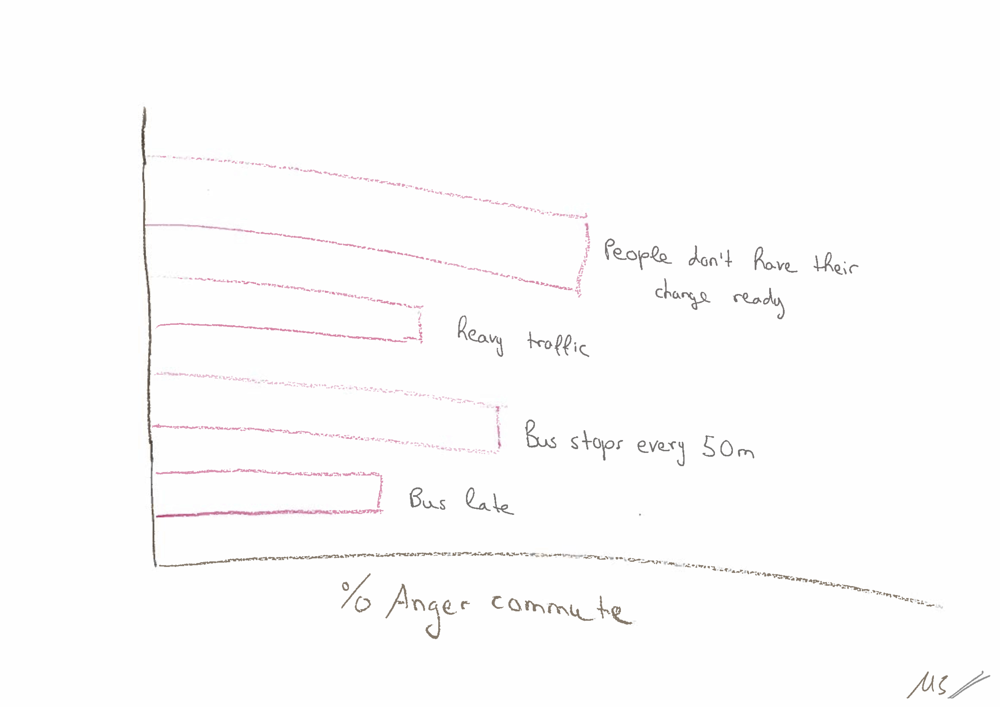
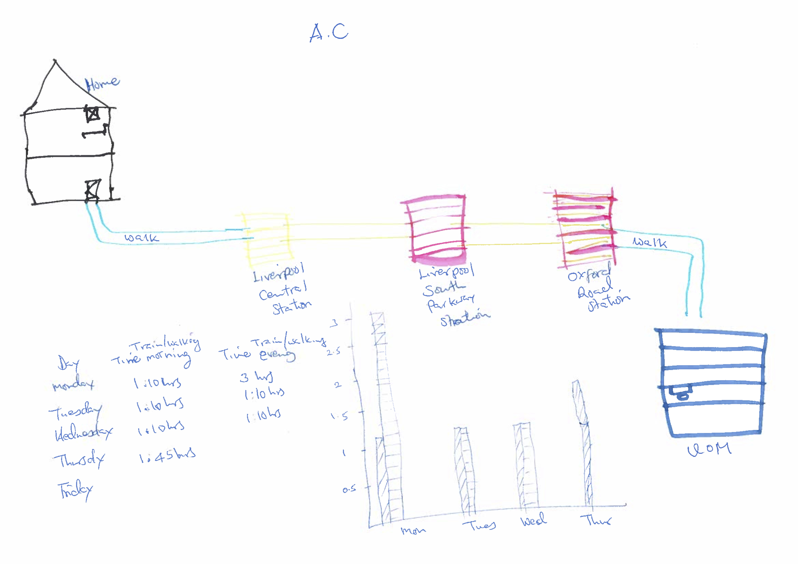

<!--     -->

<!-- ### Here are the data visualisations that you created in "Getting Started in R: an introduction to data analysis and visualisation", a [methods@manchester](http://www.methods.manchester.ac.uk) Summer School course: -->

<!--   -->

<!--  -->
<!--  -->

<!--   -->

<!--  -->
<!--  -->

<!--   -->

<!--  -->
<!--  -->

<!--   -->

<!--  -->
<!--  -->

<!--   -->

<!--  -->
<!--  -->
