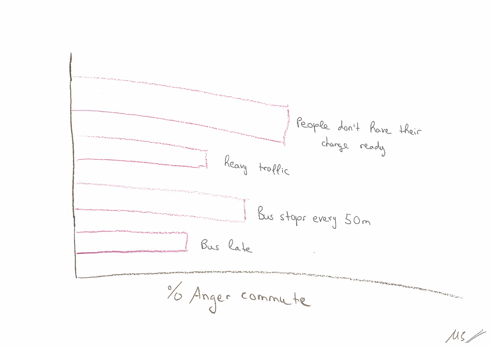
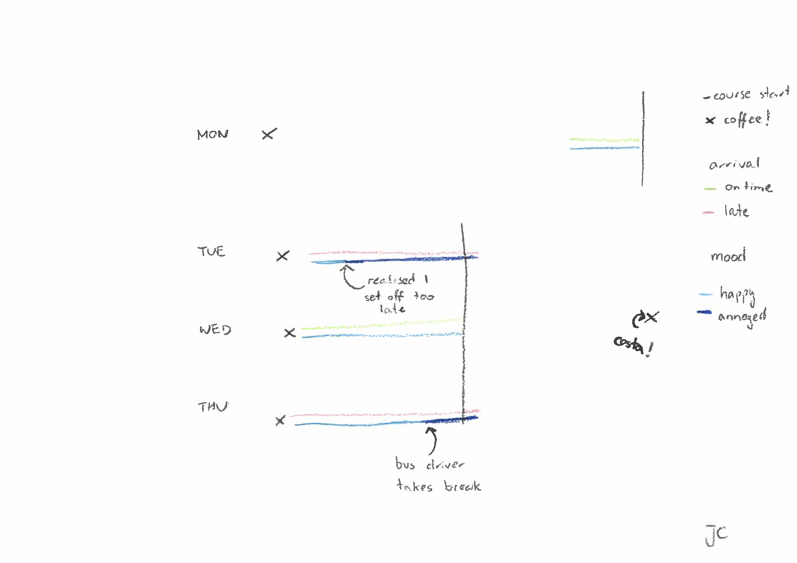
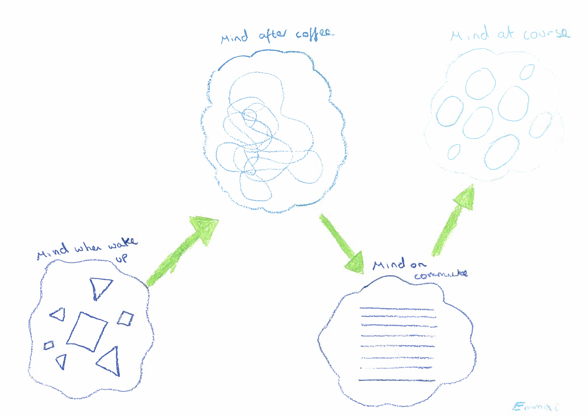
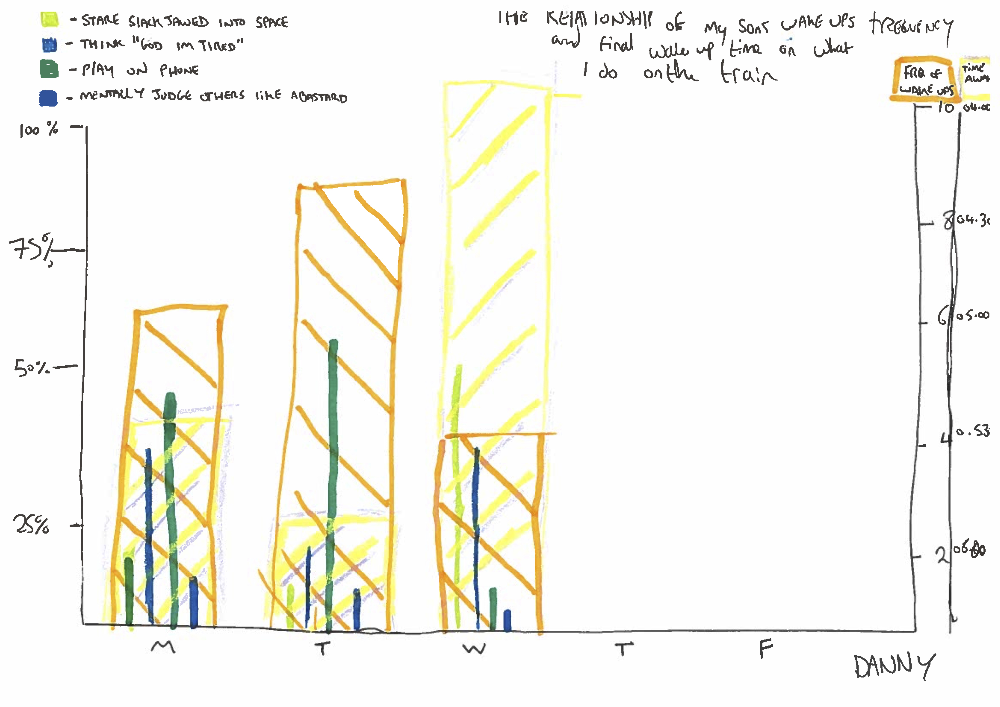
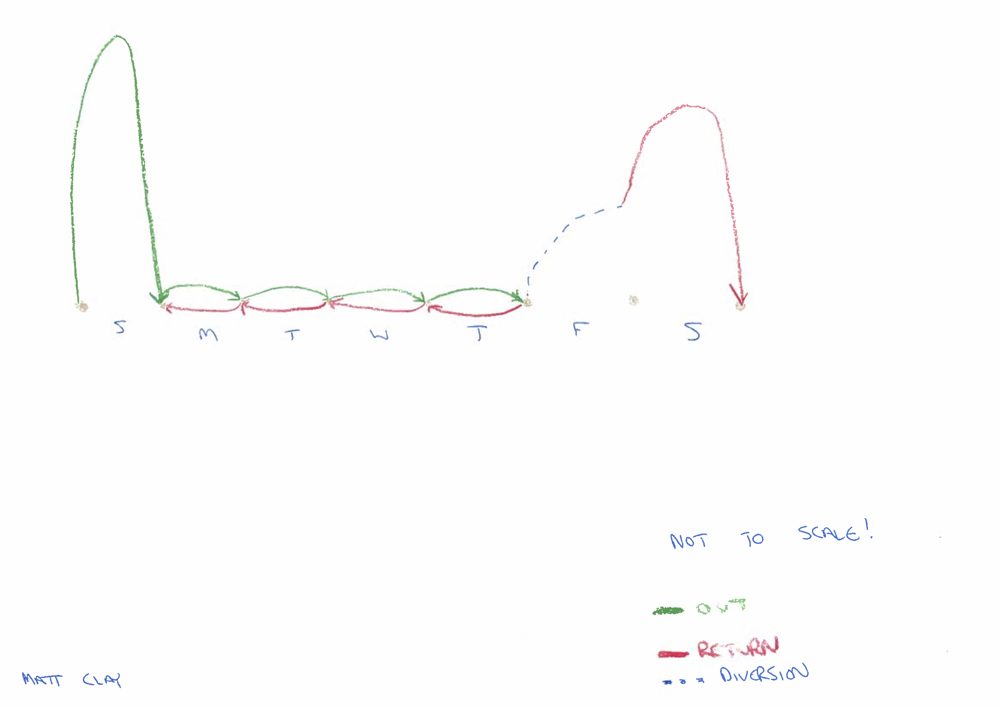
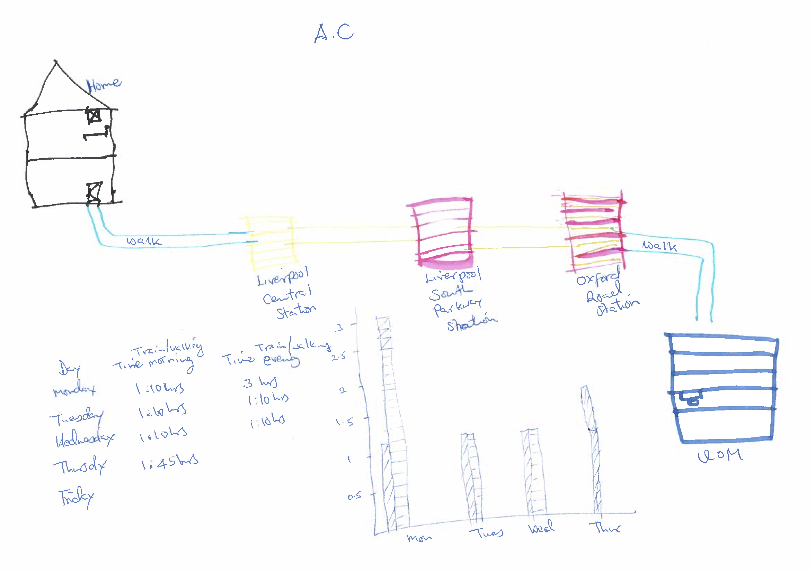
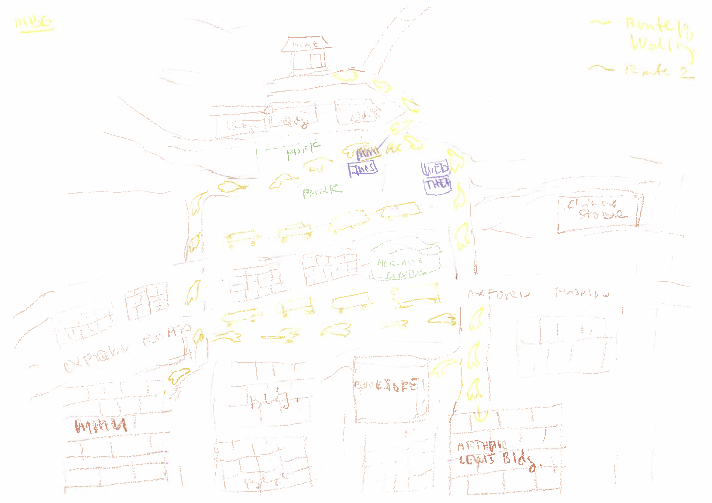
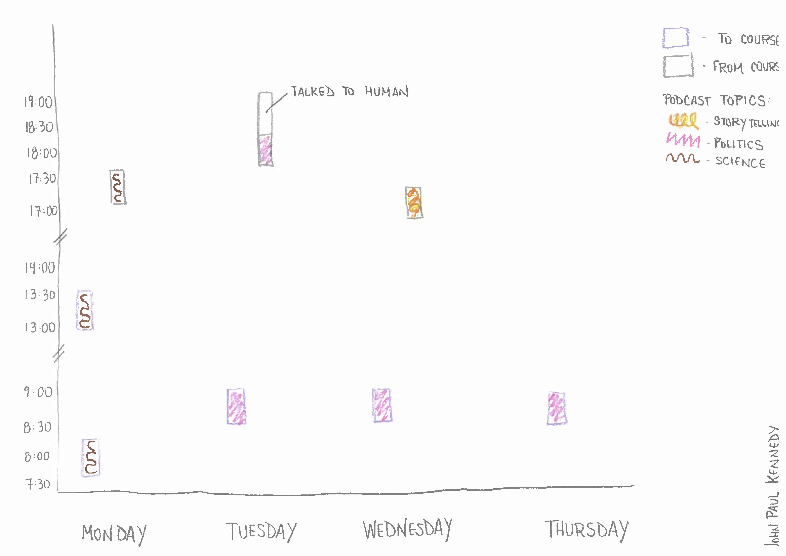
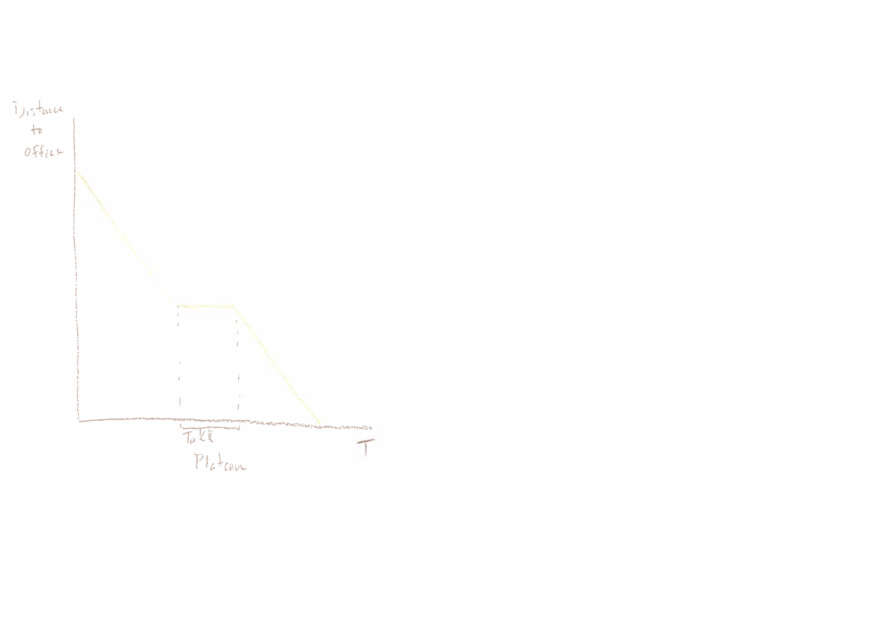
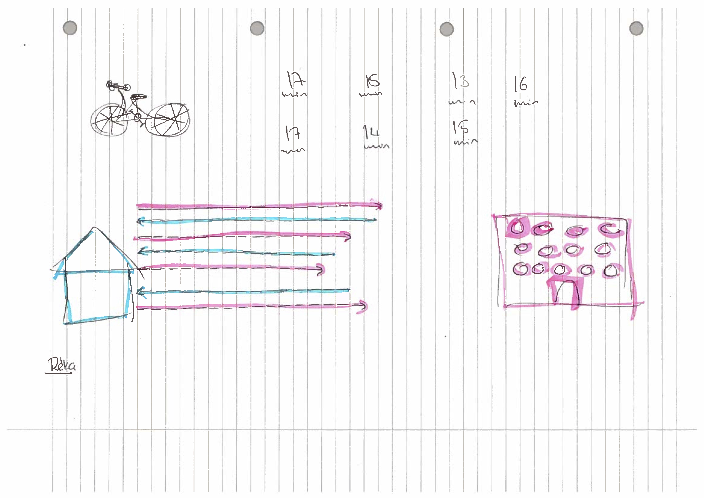

### Here are the data visualisations that you created in "Getting Started in R: an introduction to data analysis and visualisation", a [methods@manchester](http://www.methods.manchester.ac.uk) Summer School course:

```{r, out.width="700px", out.height="1000px", echo = F}
knitr::include_graphics("C:/Users/PhD/OneDrive - MMU/Teaching/UofM/GSinR summer school/GSinR/modules/visualise/activity/img/2019/single_image.pdf")
```


```{r, out.width="700px", out.height="1000px", echo = F}
knitr::include_graphics("C:/Users/PhD/OneDrive - MMU/Teaching/UofM/GSinR summer school/GSinR/modules/visualise/activity/img/2019/multiple_images.pdf")
```


<!-- <br> <br> -->

<!-- ### Here are the data visualisations that you created in "Getting Started in R: an introduction to data analysis and visualisation", a [methods@manchester](http://www.methods.manchester.ac.uk) Summer School course: -->

<!-- <br> -->


<!--  -->
<!--  -->

<!-- <br> -->

<!--  -->
<!--  -->

<!-- <br> -->

<!--  -->
<!--  -->

<!-- <br> -->

<!--  -->
<!--  -->

<!-- <br> -->

<!--  -->
<!--  -->
