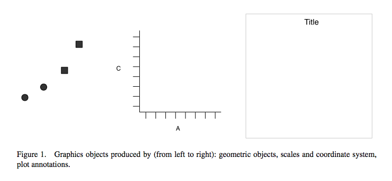

```{r setup, include=FALSE}
options(htmltools.dir.version = FALSE)
```

class: inverse, center, middle

# Data viz

---
### The grammar of graphics


[Wickham, H. (2010). A layered grammar of graphics. Journal of Computational and Graphical Statistics, 19(1), 3-28.](http://vita.had.co.nz/papers/layered-grammar.pdf)

---
### The grammar of graphics




[Wickham, H. (2010). A layered grammar of graphics. Journal of Computational and Graphical Statistics, 19(1), 3-28.](http://vita.had.co.nz/papers/layered-grammar.pdf)

---
### The grammar of graphics


[Wickham, H. (2010). A layered grammar of graphics. Journal of Computational and Graphical Statistics, 19(1), 3-28.](http://vita.had.co.nz/papers/layered-grammar.pdf)

---

### The grammar of graphics


---
### Creating a ggplot

```{r, warning = F, message = F}
library(ggplot2)
```


```{r, out.height= "400px"}
ggplot(data = mpg) + 
  geom_point(mapping = aes(x = displ, y = hwy))
```
 
  

---
### Pseudocode


```{r, eval=FALSE, warning = F, message=F}

ggplot(data = <DATA>) + 
  <GEOM_FUNCTION>(mapping = aes(<MAPPINGS>))

```


---
### 3 variables to 1 plot: `colour =`


```{r, out.height= "400px"}
ggplot(data = mpg) + 
  geom_point(mapping = aes(x = displ, y = hwy, colour = class))
```

---
### 3 variables to 1 plot: `size =`

```{r, out.height= "400px"}
ggplot(data = mpg) + 
  geom_point(mapping = aes(x = displ, y = hwy, size = class))
```


---
### 3 variables to 1 plot: `shape =`

```{r, out.height= "330px"}
ggplot(data = mpg) + 
  geom_point(mapping = aes(x = displ, y = hwy, shape = class))
```


---
### 3 variables to 1 plot: `facet_wrap()`

```{r, out.height= "400px"}
ggplot(data = mpg) + 
  geom_point(mapping = aes(x = displ, y = hwy)) + 
  facet_wrap(~ class, nrow = 2)
```


---
### Geoms

How are these two plots similar?

```{r, out.width = "400px", echo=FALSE}
knitr::include_graphics("http://r4ds.had.co.nz/visualize_files/figure-html/unnamed-chunk-18-1.png")
knitr::include_graphics("http://r4ds.had.co.nz/visualize_files/figure-html/unnamed-chunk-18-2.png")
```


---
### Geoms


```{r, warning=FALSE, message=FALSE, out.height="400px"}
ggplot(data = mpg) + 
  geom_point(mapping  = aes(x = displ, y = hwy)) +
  geom_smooth(mapping = aes(x = displ, y = hwy))
```

---
### Geoms ++


---

### Geoms ++

[Online companions](https://www.trafforddatalab.io/graphics_companion/)


---

### Making this plot

```{r, echo = FALSE}
bp <- ggplot(data = PlantGrowth) +
  geom_boxplot(mapping = aes(x = group, y = weight, fill = group),
               size = 1.2, alpha = 0.8) +
  scale_x_discrete(breaks = c("ctrl"   , "trt1"  , "trt2"),
                   labels = c("control", "treat1", "treat2")) +
  labs(title = "Figure 1: group distributions",
         x = " ") +
  scale_fill_brewer(palette = "Accent") +
  theme_minimal() +
  theme(legend.position = "none",
        plot.title = element_text(size=18),
        axis.text.x  = element_text(color="#707070",
                                   size=12),
        axis.title.y = element_text(size=16),
        axis.text.y  = element_text(color="#707070",
                                   size=10,
                                   angle=45))
bp
```

---

### Data + aesthetics + geom

```{r, eval = FALSE}
bp <- ggplot(data = PlantGrowth) +
  geom_boxplot(mapping = aes(x = group, y = weight))
bp
```

---

### Initial tweaks

```{r, eval = FALSE}
bp <- ggplot(data = PlantGrowth) +
  geom_boxplot(mapping = aes(x = group, y = weight, fill = group),
               size = 1.2, alpha = 0.8)
bp
```

---

### Axes

```{r, eval = FALSE}
bp + scale_x_discrete(breaks = c("ctrl"   , "trt1"  , "trt2"),
                      labels = c("control", "treat1", "treat2"))

```


```{r, eval = FALSE}
# Hide x tick marks, labels, and grid lines
bp + scale_x_discrete(breaks=NULL) 
```

---

### Labels

```{r, eval = FALSE}
bp + labs(title = "Figure 1: group distributions", x = " ")

```

---

### Colour brewers

```{r, eval = FALSE}
bp + scale_fill_brewer(palette = "Accent")

```

---

### Themes

```{r, eval = FALSE}
bp + theme_minimal()

```

---

### Themes (specific options)

```{r, eval = FALSE}
bp + theme(legend.position = "none",
        axis.text.x = element_text(color="#707070",
                                   size=12),
        axis.title.x = element_text(size = 14),
        axis.text.y = element_text(color="#707070",
                                   size=10,
                                   angle=45))

```

---

### Making this plot

```{r, echo = TRUE, eval = FALSE}
bp <- ggplot(data = PlantGrowth) +
  geom_boxplot(mapping = aes(x = group, y = weight, fill = group),
               size = 1.2, alpha = 0.8) +
  scale_x_discrete(breaks = c("ctrl"   , "trt1"  , "trt2"),
                   labels = c("control", "treat1", "treat2")) +
  labs(title = "Figure 1: group distributions",
         x = " ") +
  scale_fill_brewer(palette = "Accent") +
  theme_minimal() +
  theme(legend.position = "none",
        plot.title = element_text(size=18),
        axis.text.x  = element_text(color="#707070",
                                   size=12),
        axis.title.y = element_text(size=16),
        axis.text.y  = element_text(color="#707070",
                                   size=10,
                                   angle=45))
bp
```

---

### Making this plot interactive

```{r, echo = FALSE, message=FALSE}
library(plotly)
```

```{r, eval = FALSE}
ggplotly(bp)
```

---

### Making this plot interactive

```{r, echo = FALSE}
ggplotly(bp)
```


---
###Rcolorbrewer

[Sequential, diverging and qualitative colour scales from colorbrewer.org](http://ggplot2.tidyverse.org/reference/scale_brewer.html)

&

[Colour summaries from http://www.cookbook-r.com](http://www.cookbook-r.com/Graphs/Colors_(ggplot2))


---

### It's all the same!


